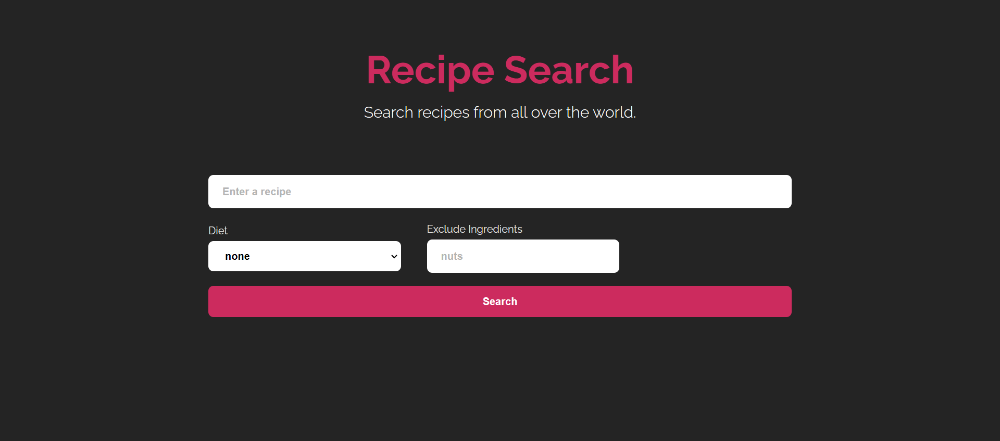

<h1 align="center">🍜 Cooklet</h1>
<br>

> A simple recipe browsing app built with [React](https://react.dev/), using [Spoonacular API](https://spoonacular.com/food-api).

Live Demo: [cooklet.vercel.app](cooklet.vercel.app)

## 📸 Screenshots



## 🛠️ Setup

```bash
# Clone the project to your machine
git clone https://github.com/Chai4523/cooklet.git
cd cooklet

# This project uses pnpm as package manager, install if you dont have it
npm install -g pnpm

# Install dependencies
pnpm install

# Run the development server
pnpm run dev
```

## 🤝 Acknowledgements


This project uses the Spoonacular API but is not endorsed or certified by Spoonacular.